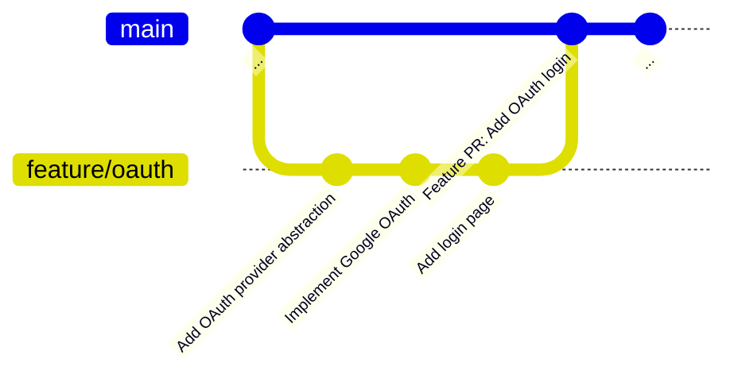

# Use a Tiered Commit and PR Structure

## Context and Problem Statement

These guidelines assume an agent-first development workflow where AI agents generate all code ([Bet 0001](../bets/0001-agents-reliably-make-atomic-changes.md)). Agents produce many small changes — renaming a type, moving a file, adding a validation check — but features require hundreds of such changes composed into coherent, deployable units. How should these changes be organized into commits and pull requests so that:

- Agent-generated work is reviewable at the right granularity?
- Git history at a meaningful granularity is available locally — enabling fast agent tooling (`git bisect` to find which commit broke something, `git revert` to undo a specific commit, `git cherry-pick` to copy a specific commit to another branch) without network round-trips to a hosting platform?
- The transition from full human review to graduated agent autonomy is supported?

[ADR 0004](0004-use-conventional-commits.md) addresses commit message *format*. This decision addresses commit and PR *scope* — what belongs in a commit, how commits compose into PRs, and how PRs merge into main.

## Decision Drivers

* **Agent-first workflow** — agents produce atomic changes naturally; the structure should leverage this rather than fight it ([Bet 0001](../bets/0001-agents-reliably-make-atomic-changes.md))
* **Reviewability** — humans (and reviewing agents) need changes at a granularity they can reason about; too small is noise, too large is overwhelming
* **Local-first history** — agents and tooling operate fastest on local data; `git log`, `git bisect`, and `git revert` should work at logical-change granularity from the local repository, without network round-trips to a hosting platform's PR UI
* **Graduated trust** — the structure must support a transition from full human review to agent-reviewed code as reliability is proven
* **Tooling effectiveness** — `git bisect` (binary search to find which commit introduced a bug) is only useful if each commit is a small, self-contained change — otherwise it lands on a large diff that still requires manual investigation. `git revert` (undo a specific commit) is only safe if commits don't mix unrelated concerns — otherwise reverting one broken change accidentally undoes unrelated work bundled in the same commit.

## Considered Options

* Tiered commit and PR structure with merge commits
* Flat atomic commits with rebase merge
* Feature-sized commits (one commit per feature)
* Squash-merge-everything
* Trunk-based development (commit directly to main)

## Decision Outcome

Chosen option: "Tiered commit and PR structure with merge commits", because it provides reviewable units at multiple granularities during development, preserves logical-level history in git long-term, and supports an agent-first workflow with graduated trust.

The structure has three tiers:

**Tier 1 — Atomic commits.** The base unit during development. Each commit is one logical change, describable without the word "and." Examples: "rename User type to Account" (implied: update all imports), "move auth module to security/" (implied: update all references), "add email validation to signup", "implement password hashing function". Atomic commits should be kept reasonably small — "add payments" is one logical change but too large; it should be decomposed. **Every atomic commit must leave the codebase in a passing state** (compiles, tests pass). This means a "rename type" commit includes all the call site updates needed to restore passing state — the rename and its consequences are one atomic change, even if that touches many files. Atomic commits are **ephemeral** — they exist during development and PR review for maximum reviewability, then are squashed (combined into a single commit) when the logical PR merges.

**Tier 2 — Logical PRs.** A single PR composed of atomic commits, representing a coherent, reviewable unit of work. Examples: "implement Google OAuth provider", "add token refresh logic", "create login page UI." Each logical PR must leave the codebase in a passing state. When a feature requires multiple logical PRs, they are organized as stacked PRs (a series of dependent PRs where each builds on the previous one, reviewed and merged incrementally). This enables incremental review and CI validation rather than waiting for the entire feature to be complete. When a logical PR merges into the feature branch, its atomic commits are squashed into a single commit. This is the granularity preserved in git long-term. The specific stacking tooling is not prescribed (see More Information).

**Tier 3 — Feature PRs.** The top-level PR that merges into main. Composed of logical-level commits (one per logical PR). Represents a complete, deployable feature or change. Merged using merge commits (`--no-ff`, which creates a dedicated "merge commit" that records when a branch was integrated, rather than flattening or replaying the history). This preserves the logical-level history in git while maintaining a clean feature-level view via `git log --first-parent` (which shows only the merge commits, skipping the detailed history within each merge).

### Example: "Add OAuth Login"

**During PR review**, reviewers see atomic commits within each logical PR:

```
Logical PR #2: "Implement Google OAuth"
├── add google-oauth dep           ← atomic commit (visible during review)
├── implement GoogleProvider       ← atomic commit
├── add Google token validation    ← atomic commit
└── register Google provider       ← atomic commit
```

**After merge**, the atomic commits are squashed. The **git history** looks like this:



Each logical PR (Tier 2) is a single squashed commit on the feature branch. The feature PR (Tier 3) merges into main with `--no-ff`, creating a merge commit that acts as a bookmark for navigating the history.

#### Navigating the history

Because merge commits preserve the branch structure, you can view the history at two levels using `git log`. The key concept: every merge commit has two parents — the branch it merged *into* (first parent, accessed with `^1`) and the branch it merged *from* (second parent, accessed with `^2`).

**Feature-level view** — what features were shipped to main?

```
$ git log --first-parent --oneline main
a1b2c3d  Feature PR: Add OAuth login
...      (previous features on main)
```

`--first-parent` follows only the main line, skipping everything inside each merge. This gives a clean, high-level changelog.

**Logical-level view** — what logical steps make up a specific feature?

```
$ git log --oneline a1b2c3d^1..a1b2c3d^2
f4e5d6c  Add login page
b7a8c9d  Implement Google OAuth
e1f2a3b  Add OAuth provider abstraction
```

Here, `a1b2c3d^2` is the tip of the feature branch (the branch that was merged in), and `a1b2c3d^1` is the main commit just before the merge. The `..` range means "show commits reachable from the right side but not the left side." This shows the squashed logical-level commits within the feature.

**Atomic-level view** — for finer detail, consult the logical PR on the hosting platform (e.g., GitHub). The atomic commits are preserved in the PR's commit history, even after squash-merge. This requires a network call but is rarely needed after the initial review period.

### Consequences

* Good, because agents can commit at their natural granularity (atomic) during development without artificial bundling
* Good, because reviewers (human or agent) see atomic detail during PR review — maximum visibility when it matters most
* Good, because git history stays clean long-term — logical-level commits, not hundreds of atomic ones
* Good, because `git bisect` can pinpoint issues to a specific logical change, and `git revert` can undo an entire logical PR cleanly
* Good, because `git log --first-parent` shows clean feature-level history while `git log` reveals logical-level detail
* Good, because stacked PRs at the logical level enable incremental CI and review, unblocking parallel work
* Good, because the structure supports graduated trust — start with human review at the logical level, transition to agent review as reliability is proven
* Bad, because the 3-tier model adds process complexity that teams must internalize
* Bad, because merge commits create a more complex git graph than squash or rebase strategies
* Bad, because stacked PR tooling is still maturing (GitHub native support is in preview as of Q2 2026)
* Bad, because "atomic" is inherently subjective — what constitutes "one logical change" requires judgment and may be inconsistent across contributors (human or agent)
* Bad, because atomic-level history is only available via the hosting platform's PR UI after merge — `git bisect` cannot narrow below the logical level from local git alone
* Neutral, because commit scope cannot be automatically enforced, unlike commit message format (ADR 0004)

### Confirmation

Compliance is enforced through two mechanisms:

1. **Agent tooling**: agents are configured to produce atomic commits by design, with guidelines and prompts that encode the atomic commit discipline
2. **Code review norms**: reviewers (human or agent) are expected to flag non-atomic commits and request splitting; review checklists include commit granularity as a criterion

A future ADR will address code review policy in detail, including the graduated trust model for transitioning from human to agent review.

## Pros and Cons of the Options

### Tiered commit and PR structure with merge commits

Three levels of granularity (atomic commits → squashed logical commits → feature PRs), merged to main with `--no-ff` merge commits. Atomic commits are visible during PR review but squashed when merging.

* Good, because atomic detail is available during review, when it's most useful
* Good, because git history stays clean — logical-level commits, not hundreds of atomic ones
* Good, because `git log --first-parent` provides clean feature-level view
* Good, because stacked PRs enable incremental review and CI at the logical level
* Good, because naturally fits agent workflows that produce small, frequent changes
* Good, because supports graduated trust for review delegation
* Neutral, because requires stacked PR tooling (to manage dependent PRs) which is maturing but not yet standard
* Bad, because most complex model to understand and follow
* Bad, because merge commits create a non-linear git graph
* Bad, because atomic history is lost from git after squash — only accessible via hosting platform

### Flat atomic commits with rebase merge

All atomic commits are rebased (replayed one by one) directly onto main. No logical or feature grouping in git history.

* Good, because simple linear history
* Good, because every atomic change is individually visible on main
* Good, because `git bisect` works at maximum granularity
* Bad, because main becomes extremely noisy — hundreds of tiny commits per feature
* Bad, because no way to see feature-level or logical-level groupings in git
* Bad, because `git revert` of a feature requires identifying and reverting many individual commits
* Bad, because no natural review boundary — review must happen at the PR level, which may be very large

### Feature-sized commits (one commit per feature)

Each feature or bug fix is a single commit, potentially large.

* Good, because simple mental model — one commit, one feature
* Good, because `git revert` of a feature is trivial
* Good, because clean, minimal commit history
* Bad, because `git bisect` cannot pinpoint issues within a feature
* Bad, because large commits are difficult to review
* Bad, because loses all intermediate context — no visibility into how a feature was built
* Bad, because does not leverage agents' natural ability to produce small, atomic changes

### Squash-merge-everything

Feature branches contain atomic commits, but they are squashed (combined into a single commit, losing the individual history) when merging to main. The entire feature becomes a single commit.

* Good, because main has a clean, linear history with one commit per PR
* Good, because `git revert` of a feature is trivial on main
* Good, because simple merge workflow, widely adopted
* Bad, because *all* sub-feature history is destroyed on main — not just atomic, but logical-level too
* Bad, because `git bisect` on main can only identify the feature PR, not even the logical step that introduced the bug
* Bad, because cherry-picking (copying a specific commit to another branch) individual logical changes from main is impossible
* Bad, because investigating a bug requires consulting the hosting platform's PR UI for any detail below the feature level

### Trunk-based development (commit directly to main)

No feature branches or PRs. All changes are committed directly to main.

* Good, because eliminates merge overhead and branch management entirely
* Good, because maximizes continuous integration — every change is immediately integrated
* Good, because simple workflow for small teams
* Bad, because no review boundary before changes reach main
* Bad, because no mechanism for staged review (logical grouping, stacked PRs)
* Bad, because incompatible with graduated trust model — no gate between agent output and main
* Bad, because broken changes immediately affect all developers

## More Information

### Relationship to Existing Decisions

* [ADR 0004: Use Conventional Commits](0004-use-conventional-commits.md) — governs commit message *format*; this ADR governs commit *scope*. Both apply: every atomic commit should have a conventional commit message.
* [Bet 0001: Agents Reliably Make Atomic Changes](../bets/0001-agents-reliably-make-atomic-changes.md) — the foundational belief that agents can reliably produce atomic changes. This ADR builds the organizational structure around that capability.
* [ADR 0007: Use Experiments for Empirical Validation](0007-use-experiments-for-empirical-validation.md) — the stacking mechanics at the logical tier may require experimentation to optimize.

### Stacking Tooling

This ADR recommends stacked PRs at the logical level but does not prescribe specific tooling. As of early 2026, options include:

- GitHub native stacked PR support (in preview, expected Q2 2026)
- Third-party stacking tools (Graphite, spr, stack-pr, git-branchless)

The choice of stacking tool should be evaluated when the team is ready to implement this workflow. The key requirement is that stacked PRs support incremental review and CI validation.

### Future Decisions

* **Code review policy** — how review responsibilities transition from human to agent as reliability is proven (graduated trust model). This is a separate decision that builds on the review boundaries defined by this ADR's tier structure.
* **PR best practices** — detailed guidelines for PR sizing, description, and lifecycle management within the tiered model.
