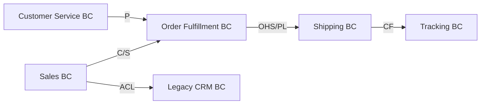
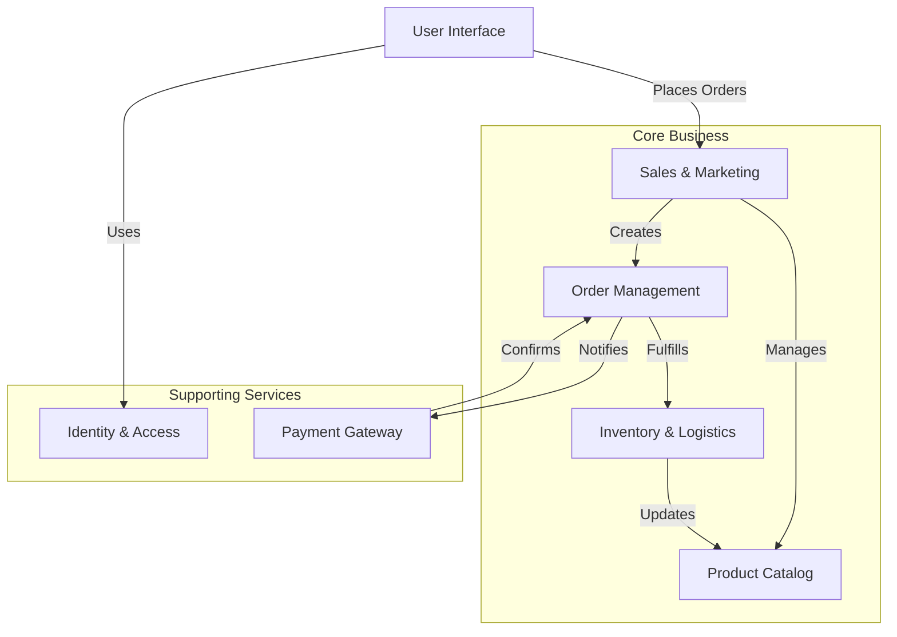

# Context Map

A Context Map is a strategic design tool used in Domain-Driven Design (DDD) to visualize the relationships between different Bounded Contexts within a larger system. It helps in understanding the boundaries, integration patterns, and collaborations between subdomains.

## How to Use This Map

This document should serve as a high-level overview of our system's landscape. It is not meant to be an exhaustive technical diagram but rather a conceptual map to facilitate communication and strategic decision-making.

1.  **Identify Bounded Contexts**: Each major business area or a logically cohesive part of the system is a Bounded Context.
2.  **Define Relationships**: Illustrate how these contexts interact using standard DDD patterns (e.g., Shared Kernel, Customer/Supplier, Conformist, Anti-Corruption Layer, Partnership, Open Host Service, Published Language).
3.  **Visual Representation**: Consider using a diagramming tool (e.g., Mermaid, PlantUML, or even simple boxes and arrows) to make the map easily understandable.
4.  **Legend**: Provide a clear legend for any symbols or colors used.

## Legend

*   **Bounded Context (BC)**: A cohesive area within the domain with its own Ubiquitous Language.
*   **Relationship Patterns**:
    *   **Shared Kernel (SK)**: Two or more BCs share a subset of their domain model. Changes in the SK impact all sharing BCs.
    *   **Customer/Supplier (C/S)**: Upstream (Supplier) provides a generic model that Downstream (Customer) consumes. Customer influences Supplier.
    *   **Conformist (CF)**: Downstream (Conformist) adapts to the Upstream's model, having no influence on it.
    *   **Anti-Corruption Layer (ACL)**: Downstream BC translates Upstream's model into its own, isolating itself from Upstream changes.
    *   **Partnership (P)**: Two BCs collaborate closely, sharing success or failure, often with a synchronized development effort.
    *   **Open Host Service (OHS)**: Upstream BC defines a public protocol (API, events) for others to consume.
    *   **Published Language (PL)**: OHS is usually accompanied by a PL, a well-documented shared language for interaction.

## Example Context Map

Here's a simple example using Mermaid syntax:

## Our System's Context Map

[Provide your actual Context Map here. You can use Mermaid, PlantUML, or describe it textually if a diagram is not feasible.]

---
