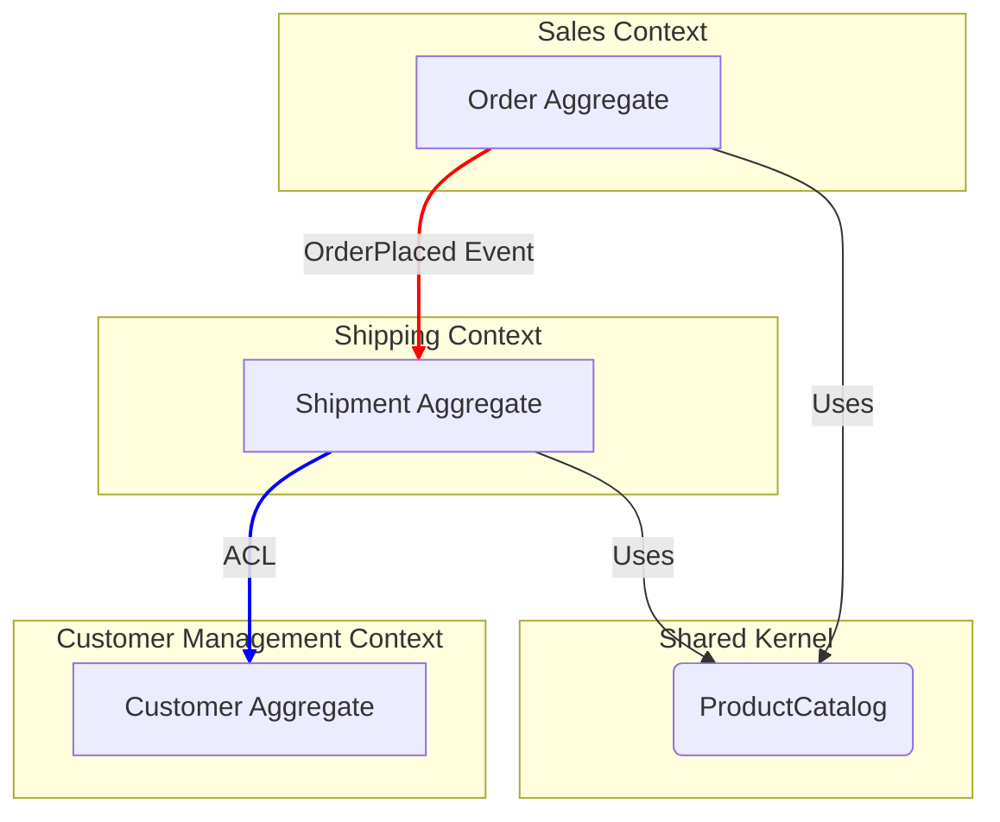

# Context Map

This document visualizes the relationships between the Bounded Contexts in the system.

## Mermaid Diagram

## Relationship Definitions

*Describe the relationship between each context, using standard Context Mapping patterns.*

- **Sales -> Shipping (Customer-Supplier / Conformist)**
  - The Shipping context (downstream) conforms to the model of the Sales context (upstream). An `OrderPlaced` event is published by Sales, which triggers the creation of a `Shipment` in the Shipping context.

- **Shipping -> Customer Management (Anti-Corruption Layer - ACL)**
  - The Shipping context needs customer information but protects its own model by using an Anti-Corruption Layer. It translates the `Customer` model from the Customer Management context into a simpler `Recipient` model that only contains the data it needs (e.g., name and address).

- **Sales & Shipping -> Shared Kernel**
  - Both contexts share a common, read-only `ProductCatalog` model. This is a small, tightly-controlled library that both teams agree upon. Changes to the Shared Kernel require coordination between both teams.
